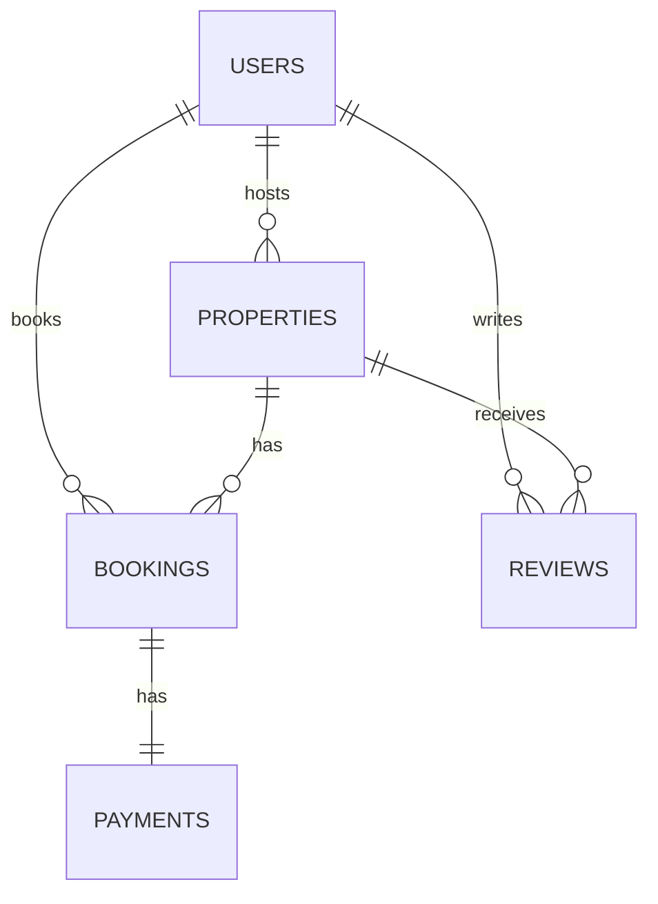

# Backend API Service  

## Project Overview  
A robust backend service providing REST and GraphQL APIs for [briefly describe application purpose - e.g. "a task management platform"]. Designed for scalability and maintainability with modern backend best practices.  

## Key Features  
- RESTful API (Django REST Framework)  
- GraphQL endpoint for flexible queries  
- JWT authentication  
- Asynchronous task processing  
- Containerized deployment  
- Automated CI/CD pipelines  

## Technology Stack  

### Core  
- **Framework**: Django 4.2+  
- **API Layer**: DRF 3.14, Graphene (GraphQL)  
- **Database**: PostgreSQL 14  

### Infrastructure  
- **Caching**: Redis 7  
- **Async Tasks**: Celery + Redis broker  
- **Containerization**: Docker + Docker Compose  

### DevOps  
- CI/CD: GitHub Actions/GitLab CI  
- Monitoring: [Specify if applicable]  
- Logging: [Specify if using ELK/Sentry/etc]  

## Team Roles  

| Role                   | Responsibilities                                                                 |
|------------------------|---------------------------------------------------------------------------------|
| **Backend Developer**  | Implements API endpoints, database schemas, and business logic.                 |
| **Database Administrator** | Manages database design, indexing, and query optimizations.                |
| **DevOps Engineer**    | Handles deployment, monitoring, and infrastructure scaling.                   |
| **QA Engineer**        | Ensures backend functionalities are thoroughly tested and meet quality standards. |  

## Development Setup  
```bash
docker-compose up -d

## Database Design

### Key Entities

#### 1. Users
- **Fields**:  
  `id` (UUID), `email` (unique), `password_hash`, `full_name`, `role` (host/guest)  
- **Relationships**:  
  - One-to-Many with `Properties` (Host owns properties)  
  - One-to-Many with `Bookings` (Guest creates bookings)  
  - One-to-Many with `Reviews` (User writes reviews)  

#### 2. Properties
- **Fields**:  
  `id` (UUID), `title`, `host_id` (FK to Users), `price_per_night`, `location`  
- **Relationships**:  
  - Many-to-One with `Users` (Owned by host)  
  - One-to-Many with `Bookings` (Property has bookings)  
  - One-to-Many with `Reviews` (Property receives reviews)  

#### 3. Bookings
- **Fields**:  
  `id` (UUID), `property_id` (FK), `guest_id` (FK to Users), `check_in_date`, `total_price`  
- **Relationships**:  
  - Many-to-One with `Users` (Booked by guest)  
  - Many-to-One with `Properties` (Booking for property)  
  - One-to-One with `Payments` (Booking has payment)  

#### 4. Reviews
- **Fields**:  
  `id` (UUID), `property_id` (FK), `author_id` (FK to Users), `rating` (1-5), `comment`  
- **Relationships**:  
  - Many-to-One with `Users` (Written by user)  
  - Many-to-One with `Properties` (Review for property)  

#### 5. Payments
- **Fields**:  
  `id` (UUID), `booking_id` (FK), `amount`, `status` (pending/complete/refunded), `payment_method`  
- **Relationships**:  
  - One-to-One with `Bookings` (Payment for booking)  

### Schema Diagram


## Feature Breakdown

### 1. User Management
- Handles user registration, authentication (JWT), and role-based access control (hosts/guests).  
- Enables secure account operations (profile updates, deactivation) and forms the core of all user interactions in the system.

### 2. Property Management
- Allows hosts to create, update, delete, and list properties with details like pricing, location, and amenities.  
- Serves as the foundation for the booking system, with availability tracking and search functionality.

### 3. Booking System
- Manages reservation lifecycle (create/modify/cancel bookings) with date conflict validation.  
- Calculates pricing dynamically and connects users to properties while enforcing business rules.

### 4. Review System
- Lets guests leave ratings and comments for properties they've booked.  
- Provides reputation metrics for hosts and helps future guests make informed decisions.

### 5. Payment Processing
- Integrates with payment gateways to handle transactions securely.  
- Tracks payment statuses and triggers booking confirmations/refunds automatically via Celery tasks.

### 6. API Interfaces
- **REST API**: Standard CRUD endpoints for web/mobile clients  
- **GraphQL**: Flexible queries for complex data fetching (e.g., properties + reviews in one request)  